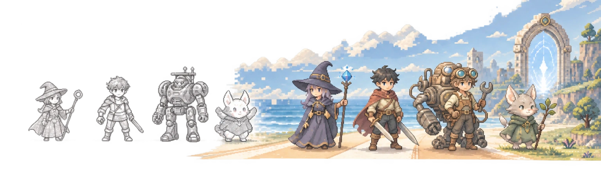

<p align="center">
  
</p>

<h1 align="center">Windup</h1>

<p align="center">
  面向国产小游戏开发者的 2D 角色动态素材生成与资产工作台
</p>

<p align="center"><strong>让你的角色，真正登场。</strong></p>

<p align="center">
  <a href="https://windup.xin"><strong>在线使用</strong></a>
  ·
  <a href="https://github.com/1024XEngineer/Windup/issues">问题与建议</a>
  ·
  <a href="openapi.json">OpenAPI</a>
</p>

<p align="center">
  <a href="https://windup.xin"></a>
  <a href="https://github.com/1024XEngineer/Windup/actions/workflows/frontend-ci.yml"></a>
  <a href="https://github.com/1024XEngineer/Windup/actions/workflows/backend.yml"></a>
  <a href="https://codecov.io/gh/1024XEngineer/Windup"></a>
</p>

<p align="center"><strong>Windup 已上线，现已开放注册。</strong></p>

<p align="center">
  
</p>

Windup 面向缺少美术产能的个人开发者和小型团队，把角色构思、动作生成、逐帧审核、试玩与引擎导出收进同一条生产链。用户从文字描述或参考图出发，最终得到可以持续补充动作、修正缺陷和重新导出的角色资产。

## 当前能力 / What You Can Do

| 能力 | 当前可用内容 |
| --- | --- |
| 项目与资产库 | 管理项目约束、角色、造型、动作与帧，继续扩展已有角色资产 |
| Quick Start | 用自然语言描述角色和动作，由系统建立标准制作流程 |
| Workflow Editor | 在真实节点画布中确认角色母版、动作首帧、生成方式、完整动画与审核状态 |
| 角色与动作生成 | 接入真实生成任务，保存任务状态与产物，支持失败恢复与结果追溯 |
| 审核与局部返工 | 对候选图和动作结果进行确认，在具体节点重试而不必重做整条流程 |
| Playtest 与导出 | 在浏览器中预览动作，并导出透明 PNG、Sprite Sheet、动画 JSON 与 ZIP 资源包 |

三渲二、多方向资产和更多引擎适配仍在推进。相关基础能力进入仓库不等于已进入在线产品主流程；当前进度以 [`main`](https://github.com/1024XEngineer/Windup/tree/main) 与 [Issues](https://github.com/1024XEngineer/Windup/issues) 为准。

## 产品链路 / Product Workflow

```text
新角色：文字描述 / 参考图 → 项目约束 → 角色母版
已有角色：从资产库继续生产 ─────────────┘
                              ↓
                     动作序列帧 → 审核 / 局部重生成
                              ↓
             Playtest 试玩 → PNG / Sprite Sheet / 元数据 → 游戏引擎
```

Windup 用角色母版约束跨帧、跨动作的视觉一致性，再用确定性的工程后处理完成去背景、切帧、对齐和打包。出现缺陷时，返工可以缩小到具体节点，已经确认的结果继续保留。

## 核心对象 / Core Concepts

| 对象 | 职责 |
| --- | --- |
| `Project` | 统一管理题材、美术风格、视角与精灵尺寸等项目级约束 |
| `Character` | 角色资产本体；造型、动作实例与帧属于它的资产树 |
| `Generation` | 一次生成任务及其输入、状态和结果，用于恢复与追溯 |
| `WorkflowRun` | 一次制作流程的持久化运行记录，连接生成、确认、回退与导出 |

`Quick Start` 与 `Workflow Editor` 是同一套流程状态的两种入口：前者用于快速建立标准流程，后者用于查看节点依赖、调整生成方式和处理局部返工。

## 技术栈 / Tech Stack

- 前端：React 19、TypeScript 6、Vite 8、Tailwind CSS 4、Vitest
- 后端：Python 3.12、FastAPI、Pydantic、SQLAlchemy、uv workspace
- 基础设施：PostgreSQL、Redis、Docker Compose、Nginx
- 工程约束：GitHub Actions、Ruff、Pytest、Import Linter、oxlint、oxfmt

## 本地开发 / Local Development

需要 Node.js 24、Python 3.12、[uv](https://docs.astral.sh/uv/)、PostgreSQL 与 Redis。

先准备本地配置和依赖服务：

```bash
cp .env.example .env
# 在 .env 中配置 POSTGRES_PASSWORD、JWT_SECRET（至少 32 字符）及所需服务凭据
docker compose up -d postgres redis
```

启动后端：

```bash
cd backend
uv sync --frozen
uv run uvicorn windup_app.bootstrap.app:create_app --factory --reload
```

另开一个终端启动前端：

```bash
cd frontend
npm ci
npm run dev
```

前端开发服务器默认访问 `http://localhost:5173`，后端健康检查为 `http://localhost:8000/health`。前端需要指向其他后端时，通过构建期变量 `VITE_API_BASE_URL` 配置。

## 质量检查 / Quality Checks

以下命令与 GitHub Actions 的主要检查保持一致：

```bash
# frontend/
npm run format:check
npm run lint
npm run typecheck
npm run test:coverage
npm run build

# backend/
uv run ruff check .
uv run python -m scripts.export_openapi
uv run lint-imports
uv run pytest -q --cov=packages
```

## 仓库结构 / Repository Structure

```text
Windup/
├── frontend/                  # React 前端、产品页面与制作流程
├── backend/                   # FastAPI 应用、领域服务、生成引擎与基础设施
├── openapi.json               # 从后端自动生成的接口契约
└── docker-compose.yml         # PostgreSQL、Redis、后端与前端构建任务
```

## 相关文档 / Documentation

- [在线产品](https://windup.xin)
- [Windup 产品策划案](https://github.com/1024XEngineer/Windup/issues/37)
- [核心流程与工作流](https://github.com/1024XEngineer/Windup/issues/25)
- [OpenAPI 接口契约](openapi.json)

## 参与贡献 / Contributing

Bug、需求和实验建议统一进入 [Issues](https://github.com/1024XEngineer/Windup/issues)。功能和核心改动按 `Proposal → Issue → Branch → Pull Request → Review` 推进，开发前请先查看对应 Issue 与领域契约。

项目的维护与历史贡献见 [Contributors](https://github.com/1024XEngineer/Windup/graphs/contributors)。

## 许可证 / License

[Apache License 2.0](LICENSE)
